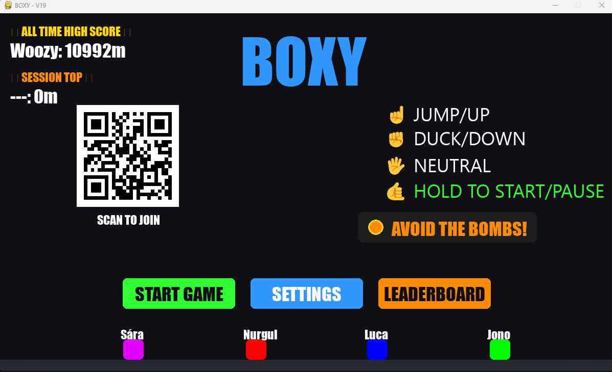
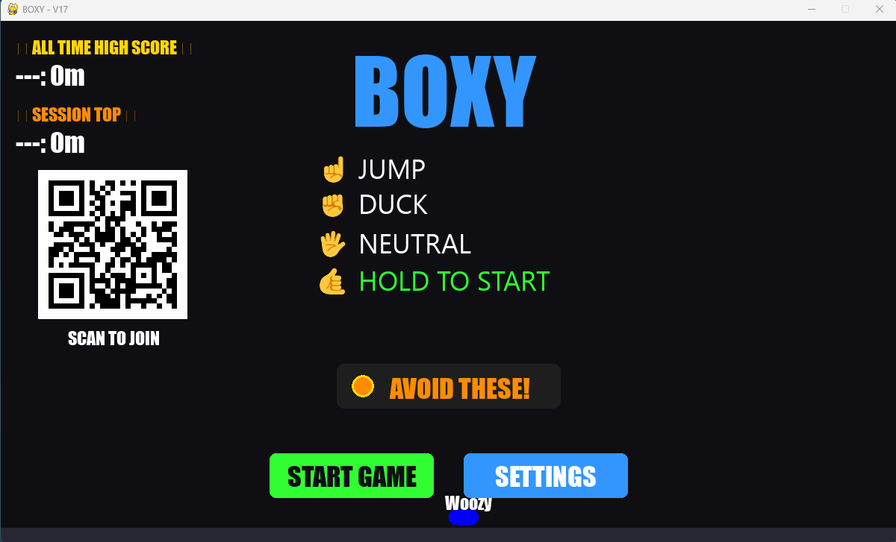
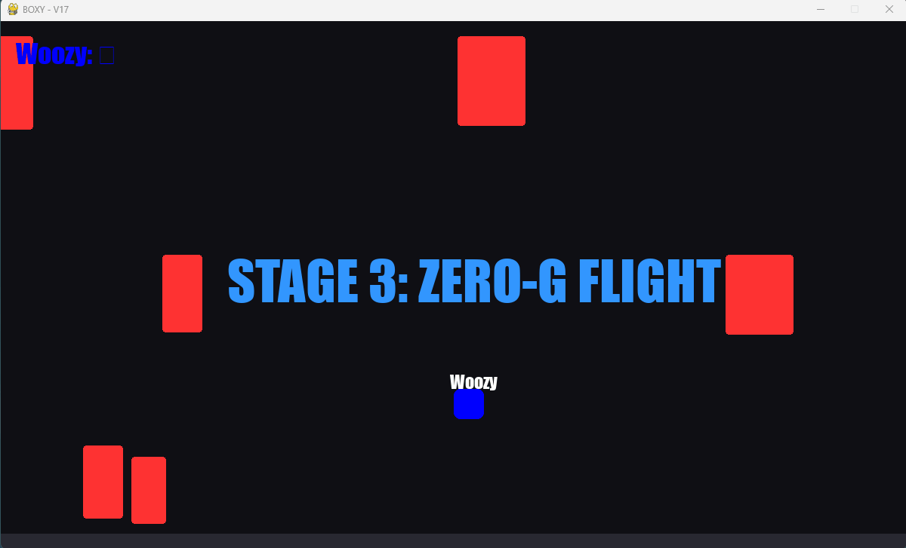
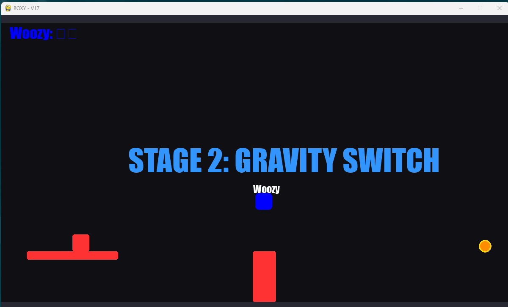
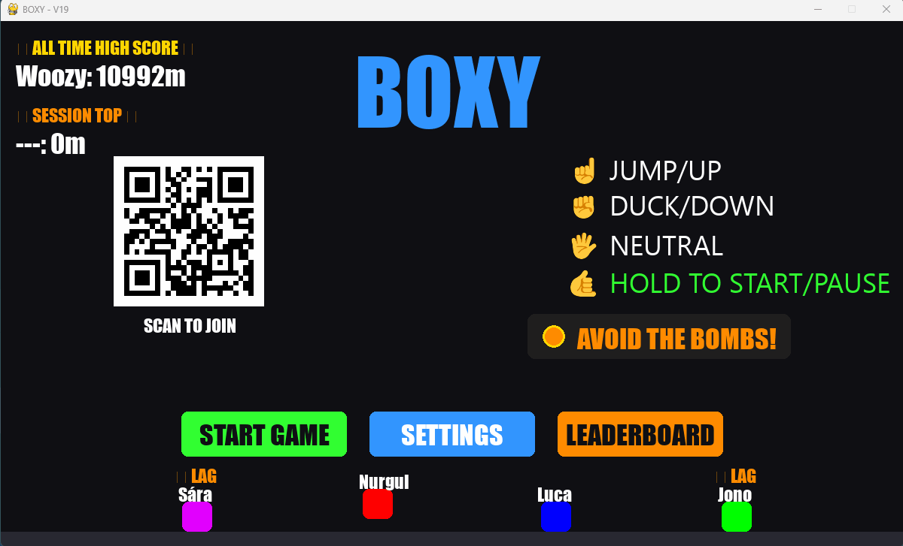
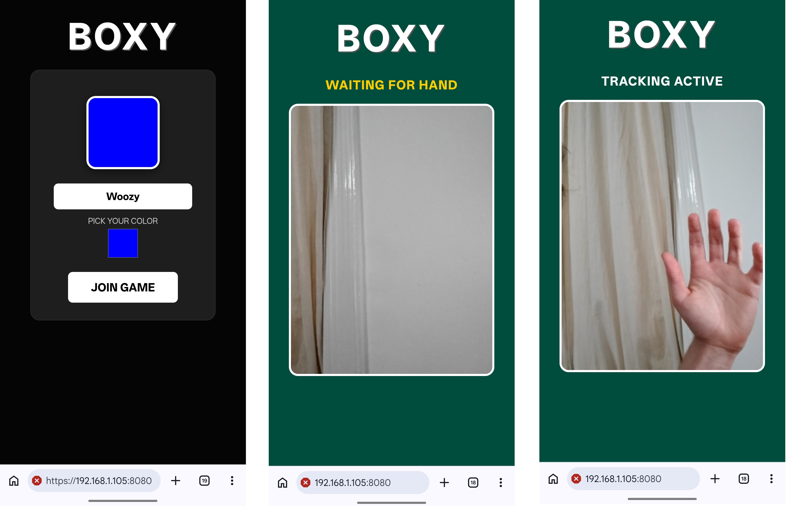
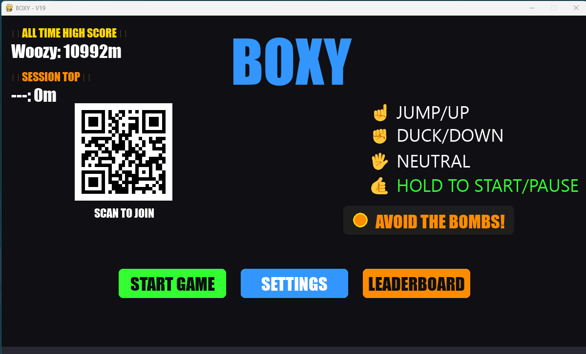
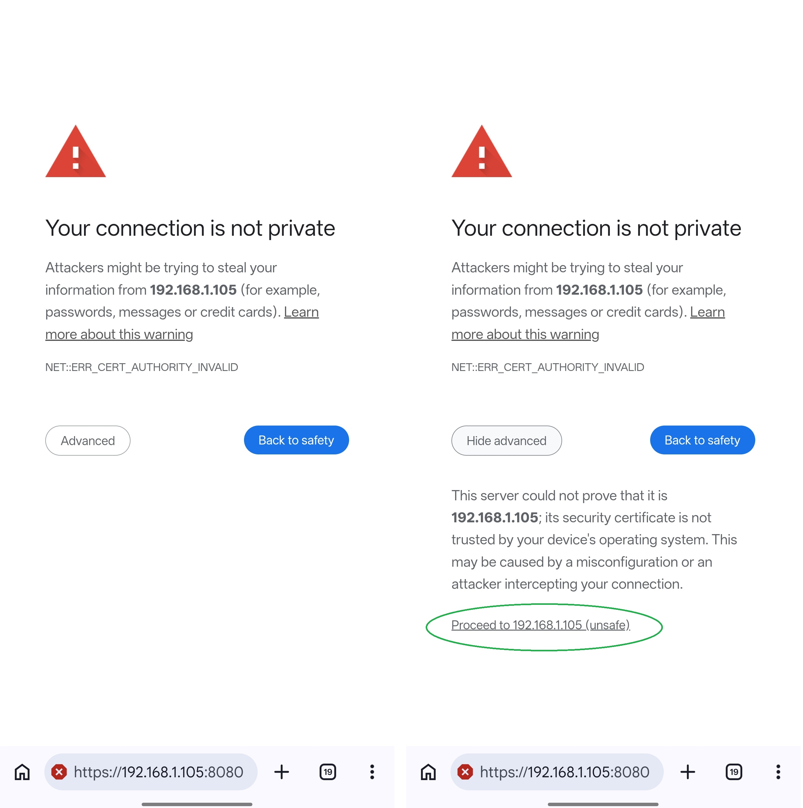
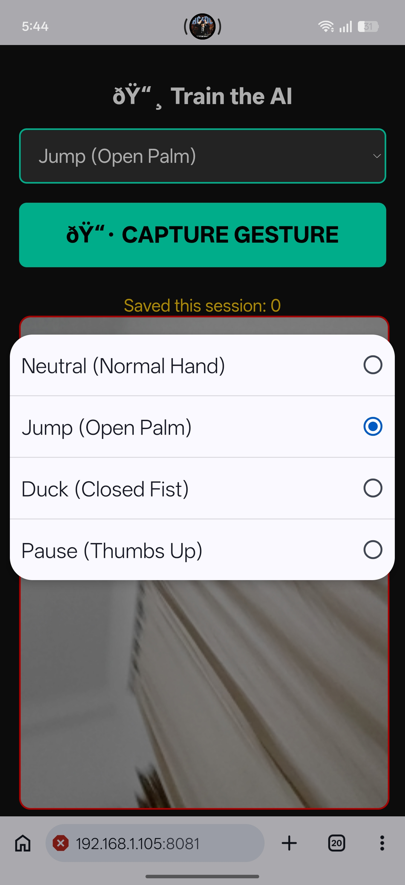
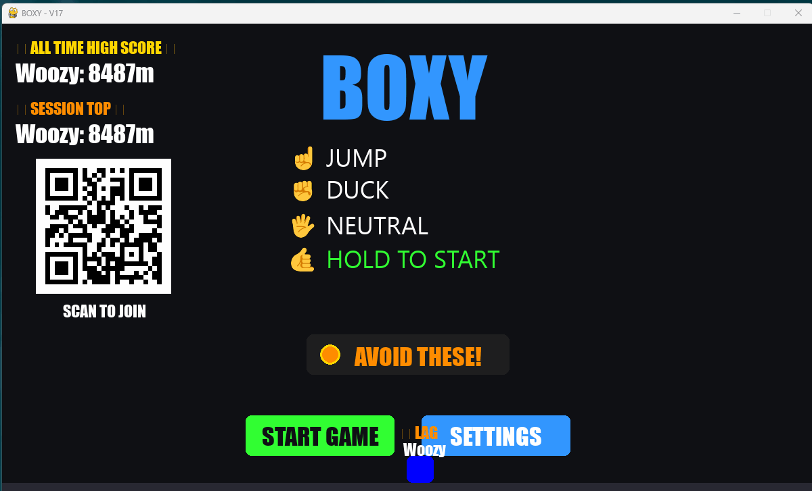

# BOXY: Gesture-Controlled Multiplayer Arcade


**BOXY** is a real-time, local-multiplayer arcade game where up to 4 players control their Box entirely through computer vision and hand gestures.

By combining an **Edge Computing** architecture, **MediaPipe** hand tracking, **PyTorch** neural networks, and a custom **Pygame-CE** physics engine, BOXY delivers a seamless, near-zero-latency motion control experience directly through mobile web browsers—no apps or external controllers required.



## 📑 Table of Contents
1. [Gameplay & Features](#️gameplay--features)
2. [Installation & Quick Start](#installation--quick-start)
3. [Data Collection & Training](#data-collection--training)
4. [Machine Learning Architecture](#️machine-learning-architecture)
5. [Troubleshooting & Known Issues](#️troubleshooting--known-issues)
6. [Possible Improvements](#possible-improvements)


## Gameplay & Features

Players survive endless, procedurally generated obstacle courses that progressively increase in speed, hazard density, and difficulty.


### Gesture Controls
Players use their mobile phones camera. The neural network tracks the hand's shape to execute in-game commands.

| Gesture | Pose | In-Game Action |
|--------|------|--------|
| **NEUTRAL** | 🖐️ Open Hand | Normal running stance |
| **JUMP** | ☝️ Index Finger Up | Jump / Fly Up / Fall to the Ceiling |
| **DUCK** | ✊ Closed Fist | Duck / Fly Down / Fall to the Floor |
| **PAUSE / READY**| 🤙 Surfer / 'Y' | Hold for 1.5 seconds to Start or Pause the game |

*Note on Horizontal Movement: BOXY uses an **auto-recovery mechanic**. If you collide with an obstacle, you are pushed backward. If you run cleanly without mistakes, the game automatically drifts you back to the safe center of the screen.*

**Ghost Respawn:**  
If you fall off the screen, you lose a life. You will respawn as a ghost dropping from the ceiling after 3 seconds.

Stages & Mechanics
The game dynamically switches between distinct gravity rules to keep players on their toes:

* **State 1 (Normal Gravity):** Standard platforming. Jump over low blocks, duck under high blocks.
* **State 2 (Zero-G Flight):** Gravity is disabled. Navigate massive obstacles floating in mid-space by flying up and down.
* **State 3 (Gravity Switch):** Jumping pulls you to the roof. Ducking pulls you to the floor.


## State 1: Noraml gravity (Always starts with this one)




## State 2: Zero gravity 
you move up and down with jump and duck




## State 3: Gravity switch
Swap which way gravity pulls you with jump and duck




## 4 players gameplay 



Multiplayer & PvP
* **Lobby Support:** Up to 4 players can join the local server simultaneously. The background of the controller dynamically matches your chosen player color.
* **Goomba Stomping:** Players feature full collision boxes. Sabotage your friends by jumping on their heads to ruin their jump arc and push them into incoming bombs or blocks.
* **High Scores:** The game features persistent local JSON tracking to record the Top 10 All-Time Champions and the best of the current Session.
* **Host Controls:** The lobby and pause menus feature host controls to adjust difficulty, toggle Endless Mode, clear high scores, and manually kick unresponsive players from the session.
  


### Menu



## Installation & Quick Start

### Prerequisites
* Python 3.9+
* A PC to run the game engine (The "Brain" and the "Brawn").
* A smartphone connected to the **same Wi-Fi network** as the PC.

### 1. Install Dependencies
Clone the repository and install the required packages.

```bash
pip install -r requirements.txt
```

(Note: We use pygame-ce for high-performance rendering. The cryptography package is required to generate secure local SSL certificates).

### 2. Launch the Game
You can start both the web server and the Pygame engine with a single command:

```
python launcher.py
```
(Alternatively, you can run python server.py and python game.py in separate terminals).


### 3. Connect Your Phone
1. When the game launches, a QR Code will appear in the game lobby.
2. Scan the QR code with your smartphone.
3. **Bypass the Security Warning:** Because the server generates a temporary local HTTPS certificate (required for browsers to allow camera access), your phone will warn you the site is "Not Secure". Click **Advanced → Proceed to site**.
4. Enter your name, pick a colour, and hit **JOIN GAME**.
5. Hold the Surfer/Y hand gesture to start





## Data Collection & Training
Before BOXY became a game, we had to build the tools to teach a neural network how to understand hand gestures. Here is a look at the repository structure and how the model was trained:

### 1. The Data Gathering Pipeline
We built a custom web-based tracking tool to record our hands.

* **`data_collector.py` & `collector_remote.html`**: These scripts hosted a dedicated recording interface on our phones. As we performed various gestures, MediaPipe extracted the 3D coordinates of 21 hand landmarks (63 data points per frame).
* **`gesture_dataset.csv`**: The output of the collector. We recorded thousands of frames of the JUMP, DUCK, PAUSE, and NEUTRAL gestures, saving the raw mathematical coordinates into a structured dataset.



### 2. The Machine Learning Pipeline
Once we had the data, we used PyTorch to build the brain.

* **`train.py`**: This script reads the CSV file, shuffles the data, and passes it through a Multi-Layer Perceptron (Neural Network) with ReLU activations and Dropout layers to prevent overfitting.
* **`label_encoder.pkl`**: Generated by Scikit-Learn during training, this file translates the AI's numeric output (e.g., Class 1) back into human-readable strings (e.g., "JUMP").
* **`gesture_model.pth`**: The final, saved weights of our trained PyTorch model. This lightweight file is loaded by the game server to perform lightning-fast inferences on live player data.

## Machine Learning Architecture
BOXY utilizes an Edge Computing architecture to achieve near-zero latency for motion controls. Rather than sending a heavy video feed from the phone to the computer, the system splits the computational load.

#### Training Results
The model was trained over 150 epochs using the Adam optimizer and Cross-Entropy Loss. As demonstrated by the terminal output below, the model successfully converged, reducing validation loss and achieving high accuracy across all gesture classes.

```text
Epoch 030 | Train Loss: 1.2704 | Val Loss: 1.2955 | Val Acc: 45.45%
Epoch 060 | Train Loss: 0.8859 | Val Loss: 1.0789 | Val Acc: 59.09%
Epoch 090 | Train Loss: 0.4870 | Val Loss: 0.6918 | Val Acc: 72.73%
Epoch 120 | Train Loss: 0.2520 | Val Loss: 0.3891 | Val Acc: 86.36%
Epoch 150 | Train Loss: 0.1704 | Val Loss: 0.2394 | Val Acc: 90.91%
Model and Encoder saved successfully.

========================================
--- Final Classification Report ---
========================================
              precision    recall  f1-score   support

        DUCK       0.86      0.86      0.86         7
        JUMP       1.00      0.83      0.91         6
     NEUTRAL       1.00      1.00      1.00         5
       PAUSE       0.80      1.00      0.89         4

    accuracy                           0.91        22
   macro avg       0.91      0.92      0.91        22
weighted avg       0.92      0.91      0.91        22
```

#### Model Performance & Analysis

* **Overall Performance:** By increasing data variance (recording different angles, hands, and distances), the model successfully generalized, achieving a robust **90.91% validation accuracy**.
* **Flawless Baseline:** The **NEUTRAL** gesture achieved perfect precision and recall (1.00). This is critical, as the game's auto-recovery physics rely on accurately detecting when a player has returned to a resting state.
* **High-Precision Platforming:** The **JUMP** gesture maintains a perfect 1.00 precision. The AI never accidentally hallucinates a jump command, which prevents unfair or accidental player deaths during precise platforming segments.
* **Engine-Level Smoothing:** While there is minor overlap between **DUCK** and **PAUSE** (PAUSE precision is 0.80), this is intentionally mitigated by the game engine. Because `PAUSE` must be held for 1.5 consecutive seconds to trigger, momentary single-frame misclassifications by the AI are completely filtered out by the game logic.
* **Conclusion:** The model demonstrates excellent generalization across varied inputs and is highly capable of driving fast-paced, real-time multiplayer gameplay.

### 1. MediaPipe (JavaScript / HTML)
This acts as the eyes of the project. The computer vision runs directly on the player's mobile browser using Google's MediaPipe Hands. For every frame, MediaPipe calculates the X, Y, and Z coordinates of 21 points. It packages these 63 raw numbers into a lightweight JSON payload and transmits them over Wi-Fi.

* **The Edge Advantage:** Transmitting text data instead of 30FPS video drastically minimizes latency and frees up the PC's CPU to run the game engine.

### 2. PyTorch & Scikit-Learn (Python)
This is the brain of the project. The `server.py` application receives the coordinates and feeds them into the custom PyTorch neural network. The output layer generates probability scores for the target classes, and the pickled Scikit-Learn LabelEncoder translates the winning ID into a game action.

### 3.  Pygame-CE & UDP Sockets
This is the engine and runs the actula game. The server instantly blasts the predicted gesture to the Pygame engine using UDP Sockets. UDP is connectionless, making it the perfect protocol for real-time inputs where dropping an old frame is better than delaying a new one. The Pygame-CE engine receives this intent and executes the custom axis-separated physics, PvP collisions, and rendering.


## Troubleshooting & Known Issues

### 1. "The site can't be reached" / Phone won't connect
This is almost always a Windows Network Profile issue. Windows blocks local traffic on "Public" networks.

* **The Fix:** Go to Windows Settings > Network & Internet > Wi-Fi. Click your network properties and change the profile from "Public" to "Private".
* **Firewall:** Ensure Windows Defender is not blocking Python on Private networks.
* **VPNs:** Temporarily disable VPNs, as they may cause the Python server to broadcast the wrong local IP address.

### 2. The HTTPS Security Warning
Mobile browsers strictly refuse to open the camera on standard http:// sites. We generate a temporary ad-hoc https:// certificate on the fly. Your phone flags this as "Not Secure" because it wasn't issued by a global authority.

* **The Fix:** This is required and completely safe. Click **Advanced → Proceed to [IP Address]**.

### 3. "LAG" Appears Over Player Avatar
Mobile browsers (especially iOS Safari) aggressively pause background tasks to save battery. To combat this, the mobile UI uses a WakeLock API and throttles network requests to 20Hz. If the "LAG" warning appears, it means the Pygame server hasn't received a packet from the phone in over 1 second. Ensure your phone screen hasn't dimmed.


### 4. Empty Square Characters in Lobby
Pygame relies on local Windows fonts to render special characters. If your Windows installation is missing the Segoe UI Symbol font, the instruction icons in the lobby will render as empty squares. The text instructions will still be readable.

## Possible Improvements
This repository represents the base version of BOXY. Future planned updates could include:

* Expanded stages with moving obstacles.
* Power-ups (Shields, Point Multipliers).
* Improved iOS Safari background execution handling.
* Cloud-based global leaderboards.
* Mobile App insteead of browser use to make connectiong faster.

#### Playthrough Demo single player



####  The Complete Data Pipeline Summary
1. **Phone Camera** captures a frame.
2. **MediaPipe (JS)** extracts 63 spatial coordinates.
3. **Wi-Fi** transmits the coordinates to the Python web server (throttled to 20Hz to prevent buffer bloat).
4. **PyTorch (Python)** processes the coordinates and predicts an integer ID.
5. **Scikit-Learn (Python)** translates the ID into a string action (e.g., `"DUCK"`).
6. **UDP Socket** instantly blasts the command to the Pygame client.
7. **Pygame-CE** executes the physics and updates the screen.


## Planned impovments
There are many improvments i want to make to the actual game play. this is just the base version.


